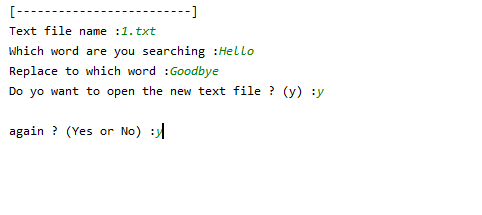

## Text Replacer
It replaces a words in a `.txt` file .

## Note
- The new file name after creation is `new_Replaced_`filename.txt
- It doesn't concern about `capitalization` of the word .
- hello = Hello = HELLO

## Screenshots
